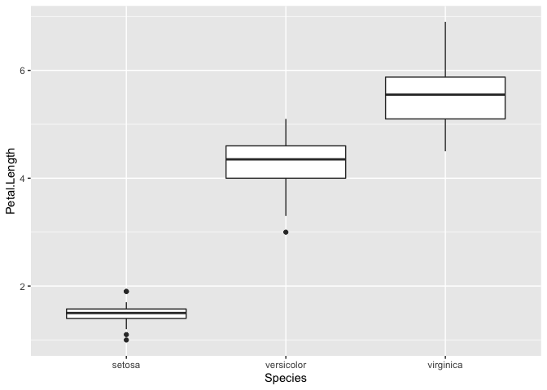

BIOL4408MarineEcology
================
TimLanglois
01/01/2020

# Using pipes and tidyverse

Things to do: General intro to R Intro to RStudio Intro to Projects

## Pipes (%\>%) in R

R is a functional language, which means that your code often contains a
lot of parenthesis, ( and ). When you have complex code, this often will
mean that you will have to nest those parentheses together. This makes
your R code hard to read and understand.

The purpose of pipes (%\>%) is to simplify the notation for the
application of several functions to a single data object.

## Nested approach without pipes:

pizza \<- take\_out(put\_in(dress\_with(dress\_with(dress\_with(pie,
sauce), oil), break(cheese), oven), oven)

## Multiple object approach without pipes:

pie\_tmp1 \<- dress\_with(pie, sauce)

pie\_tmp2 \<- dress\_with(pie\_tmp2, oil)

pie\_tmp3 \<- dress\_with(pie\_tmp3, break(cheese))

pie\_tmp4 \<- put\_in(pie\_tmp4, oven)

pizza \<- take\_out(pie\_tmp, oven)

## Making a pizza with pipes

pizza \<- pie %\>%

dress\_with(sauce) %\>%

dress\_with(oil) %\>%

dress\_with(break(cheese)) %\>%

put\_in(oven) %\>%

take\_out(oven)

And the pizza is done. Compare to previous

## Now for some worked examples

You can copy and paste these commands into R.

We are going to load the tidyr() and dplyr() package and the glimpse() a
pre-loaded dataset.

``` r
library(tidyr)
library(dplyr)

glimpse(iris)
```

    ## Observations: 150
    ## Variables: 5
    ## $ Sepal.Length <dbl> 5.1, 4.9, 4.7, 4.6, 5.0, 5.4, 4.6, 5.0, 4.4, 4.9, 5.4, 4…
    ## $ Sepal.Width  <dbl> 3.5, 3.0, 3.2, 3.1, 3.6, 3.9, 3.4, 3.4, 2.9, 3.1, 3.7, 3…
    ## $ Petal.Length <dbl> 1.4, 1.4, 1.3, 1.5, 1.4, 1.7, 1.4, 1.5, 1.4, 1.5, 1.5, 1…
    ## $ Petal.Width  <dbl> 0.2, 0.2, 0.2, 0.2, 0.2, 0.4, 0.3, 0.2, 0.2, 0.1, 0.2, 0…
    ## $ Species      <fct> setosa, setosa, setosa, setosa, setosa, setosa, setosa, …

This famous (Fisher’s or Anderson’s) iris data set gives the
measurements in centimeters of the variables sepal length and width and
petal length and width, respectively, for 50 flowers from each of 3
species of iris. The species are Iris setosa, versicolor, and virginica.

This example dataset is handy for demonstrating functions.

Let’s make an example data summary using pipes and the try to read it
out loud\!

\#\#\#Summary using pipes

“you take the Iris data, filter for petals longer than 1 cm, for each
species, then calcualte the mean sepal length, then arrange in
descending order”

``` r
iris %>%
  filter(Petal.Length > 1) %>%
  group_by(Species) %>%
  summarise(Avg_Sepal.Length = mean(Sepal.Length)) %>%
  arrange(desc(Avg_Sepal.Length))%>%
  glimpse()
```

    ## Observations: 3
    ## Variables: 2
    ## $ Species          <fct> virginica, versicolor, setosa
    ## $ Avg_Sepal.Length <dbl> 6.588000, 5.936000, 5.014286

### This is a nested version, could you read that out loud?

``` r
arrange(
  summarize(
    group_by(
      filter(iris, Petal.Length > 1),
      Species
    ),
    Avg_Sepal.Length = mean(Sepal.Length)
  ),
  desc(Avg_Sepal.Length)
)
```

    ## # A tibble: 3 x 2
    ##   Species    Avg_Sepal.Length
    ##   <fct>                 <dbl>
    ## 1 virginica              6.59
    ## 2 versicolor             5.94
    ## 3 setosa                 5.01

### Here is an intermidiate object version, this would also be hard to read out loud

``` r
a <- filter(iris, Petal.Length > 1)
b <- group_by(a, Species)
c <- summarise(b, Avg_Sepal.Length = mean(Sepal.Length))
d <- arrange(c, desc(Avg_Sepal.Length))
print(d)
```

    ## # A tibble: 3 x 2
    ##   Species    Avg_Sepal.Length
    ##   <fct>                 <dbl>
    ## 1 virginica              6.59
    ## 2 versicolor             5.94
    ## 3 setosa                 5.01

OK now lets, make one plot, then look at some marine data.

``` r
library(ggplot2)

ggplot(iris, aes(x=Species, y=Petal.Length))+
  geom_boxplot()
```

<!-- -->
